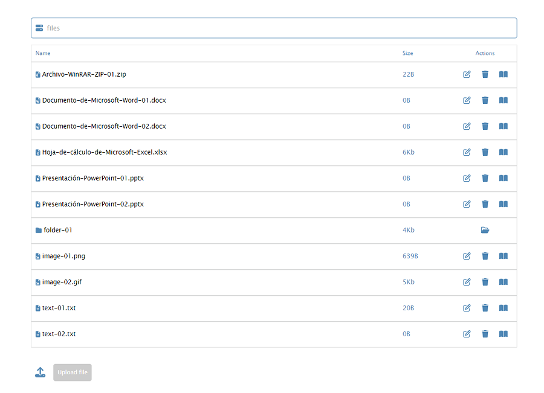
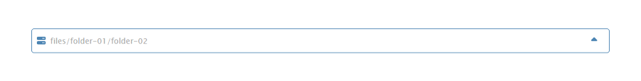

# File manager

This is a file manager project created with Angular, which interacts with an API created in PHP.

This Project was put into practice using the Linkedin Learning Advanced Angular course: File Management in PHP taught by Carlos Solís as a guide.
However, for learning purposes I've transformed the code so that it has equivalent behavior and I've also added functionalities that are not covered in the course. 

Project generated with [Angular CLI](https://github.com/angular/angular-cli) version 16.2.5.

## It allows you:

- Connect to the API through a service
- Get all the files
   
- Navigate between directories
   
- You can see the route on which you are located and return to the previous one
- Delete files
- Open files
- Rename files (validation is applied to the entered name)
- Upload files

## Development server

Run `ng serve` for a dev server. Navigate to `http://localhost:4200/`. The application will automatically reload if you change any of the source files.

## Code scaffolding

Run `ng generate component component-name` to generate a new component. You can also use `ng generate directive|pipe|service|class|guard|interface|enum|module`.

## Build

Run `ng build` to build the project. The build artifacts will be stored in the `dist/` directory.

## Running unit tests

Run `ng test` to execute the unit tests via [Karma](https://karma-runner.github.io).

## Running end-to-end tests

Run `ng e2e` to execute the end-to-end tests via a platform of your choice. To use this command, you need to first add a package that implements end-to-end testing capabilities.

## Further help

To get more help on the Angular CLI use `ng help` or go check out the [Angular CLI Overview and Command Reference](https://angular.io/cli) page.
